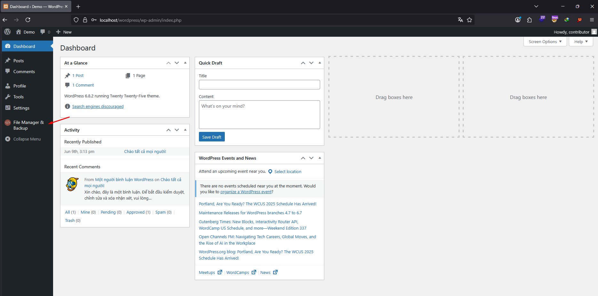
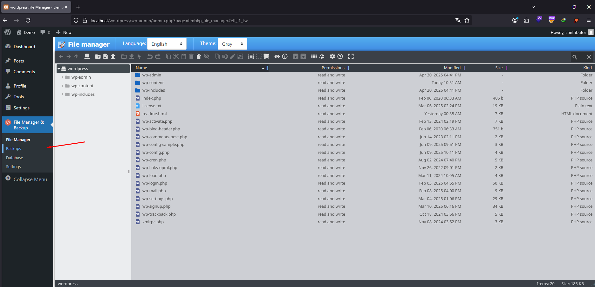
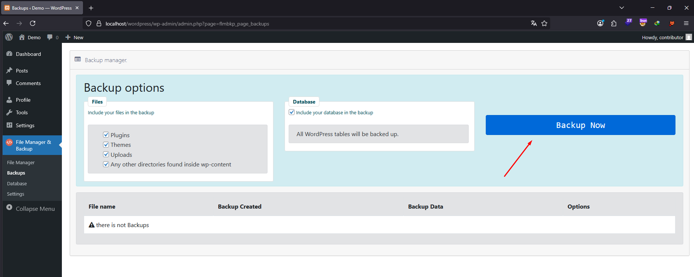
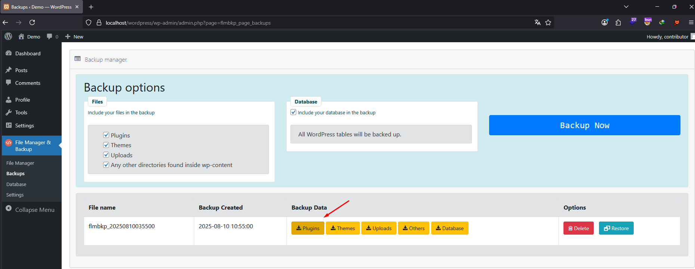
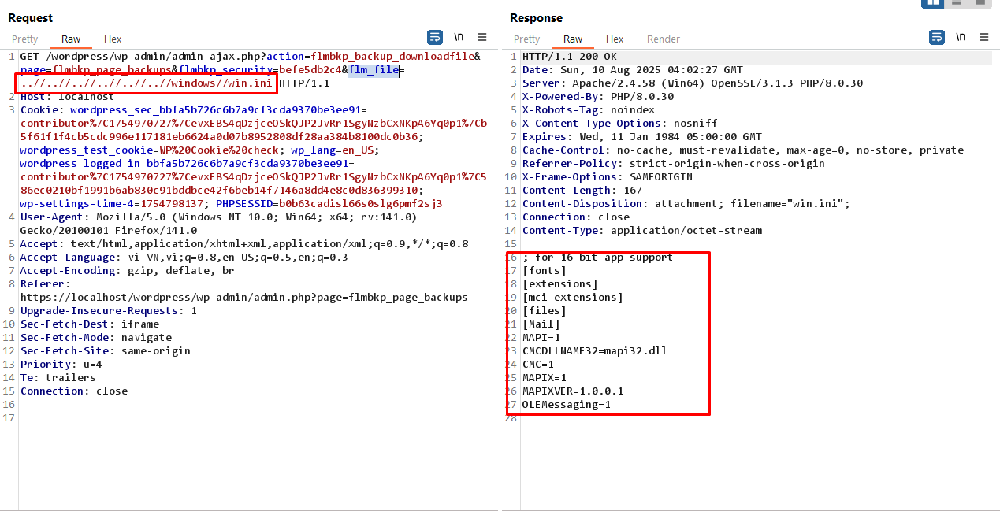

# Proof of Concept Path Traversal in File Manager, Code Editor, and Backup by Managefy 
**Vulnerability Type:** Path Traversal (Arbitrary File Download)

**Affected Function:** `ajax_downloadfile()` 

**Impact:** Authenticated users with low privilege (Subscriber+) can download arbitrary files from the server, including sensitive configuration files, by exploiting insufficient validation of the `flm_file` parameter.  

**CVSS v3.1 Score:** 6.5 (Medium)   
**Vector:** AV:N/AC:L/PR:L/UI:N/S:U/C:H/I:N/A:N

---
## Description

The `flm_file` parameter from the GET request is concatenated directly with the backup directory path without sufficient sanitization. The current sanitization function `Flmbkp_Form_Helper::sanitizeInput_html()` does not prevent sequences like `../`, allowing an attacker to traverse directories outside of the intended backup folder.

```  modules\filemanager\controllers\backups.php
// modules\filemanager\controllers\backups.php
public function ajax_downloadfile()
    {
        check_ajax_referer('flmbkp_ajax_nonce', 'flmbkp_security');
        @set_time_limit(900);
        $flm_file = (isset($_GET['flm_file'])) ? Flmbkp_Form_Helper::sanitizeInput_html($_GET['flm_file']) : '';
        
        $backup_directory=Flmbkp_Form_Helper::backup_directory();
        $fullpath = $backup_directory.'/'.$flm_file;
        
        header("Content-Length: ".filesize($fullpath));
        header("Content-type: application/octet-stream");
        header("Content-Disposition: attachment; filename=\"".basename($fullpath)."\";");
        readfile($fullpath);
        exit;
    }
```

---
### Steps to Reproduce

1.  **Login into the WordPress system** using Subscriber credentials.

2.  **Navigate to Plugins → File Manager & Backup** page.

3.  **Click the "Backup" button** to create a backup file.

4.  In the **Backup Data** section, click the **download file** option.
  
5.  Intercept the download request in **Burp Suite** and modify the `flm_file` parameter to include a path traversal payload to target a sensitive file.  


---
### Impact

Disclosure of sensitive system files.

Exposure of credentials stored in files such as wp-config.php, .env, or application logs.

Facilitates further attacks, including full system compromise.

---
### Recommendation
Use realpath() to resolve the absolute path of the requested file and ensure it is inside the backup directory.

Reject requests containing ../, %00, or other traversal-related sequences before file access.

Enforce strict capability checks (e.g., only manage_options users can download backups).

Sanitize and validate the filename against a whitelist of allowed files.

### Video POC
If you're unable to reproduce the issue exactly as described in the report, please refer to the following video demonstration (PoC) for a clear reproduction scenario:

https://www.youtube.com/watch?v=b9M0nMDpMi0